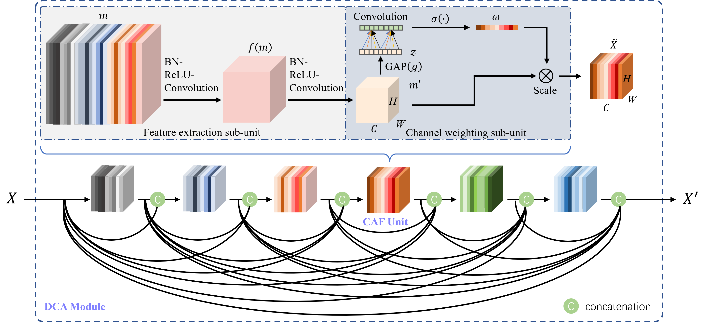

# EDCA-Net: An Evolutionary Attention-Based Network for Medical Image Classification
This is an implementation of EDCA-Net published in [International Journal of Neural System](https://www.worldscientific.com/doi/10.1142/S0129065723500107).

The code is based on [Deep-Mutual-Learning](https://github.com/chxy95/Deep-Mutual-Learning) and [ECANet](https://github.com/BangguWu/ECANet).

## Introduction
Deep learning has become a primary choice in medical image analysis due to its powerful representation capability. However, most existing deep learning models designed for medical image classification can only perform well on a specific disease. The performance drops dramatically when it comes to other diseases. Generalizability remains a challenging problem. In this paper, we propose an evolutionary attention-based network (EDCA-Net), which is an effective and robust network for medical image classification tasks. To extract task-related features from a given medical dataset, we first propose the densely connected attentional network (DCA-Net) where feature maps are automatically channel-wise weighted, and the dense connectivity pattern is introduced to improve the efficiency of information flow. To improve the model capability and generalizability, we introduce two types of evolution: intra- and inter-evolution. The intra-evolution optimizes the weights of DCA-Net, while the inter-evolution allows two instances of DCA-Net to exchange training experience during training. The evolutionary DCA-Net is referred to as EDCA-Net. The EDCA-Net is evaluated on four publicly accessible medical datasets of different diseases. Experiments showed that the EDCA-Net outperforms the state-of-the-art methods on three datasets and achieves comparable performance on the last dataset, demonstrating good generalizability for medical image classification.

## Train a pair of EDCA-Nets

```shell
python main.py --data_dir [PATH TO THE DATA] --model_num 2 --init_lr 0.0001 --num_classes [NUMBER OF CLASSES] --epochs 20 --independent False
```

The image dataset's folder should be of the following structure:

    .
    ├── train
    │   ├── class1
    │       ├── 1.png
    │       ├── 2.png
    │   ├── class2
    │       ├── 1.png
    │       ├── 2.png
    ├── test
    │   ├── class1
    │       ├── 1.png
    │       ├── 2.png
    │   ├── class2
    │       ├── 1.png
    │       ├── 2.png

## DCA module



## EDCA-Net


## Citation

    @article{zhu2022evolutionary,
       title={An Evolutionary Attention-Based Network for Medical Image Classification},
       author={Zhu, Hengde and Wang, Jian and Wang, Shui-Hua and Raman, Rajeev and Gorriz, Juan M and Zhang, Yu-Dong},
       journal={International Journal of Neural Systems},
       year={2022},
       publisher={World Scientific}
     }
